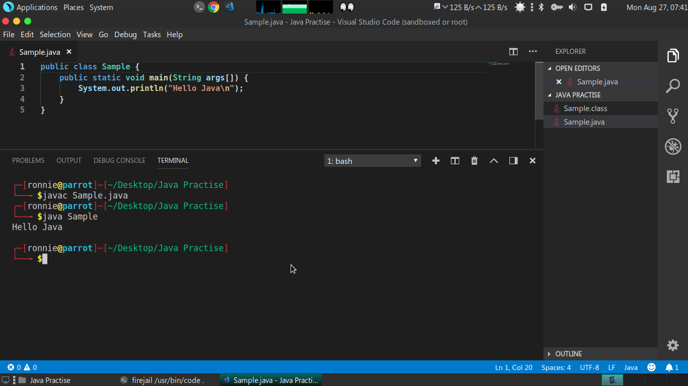

# Preface
In this activity we are going to compile and run the Java program using the command line. We are using `javac`, a standard Java compiler and `java` command while gives a Java runtime to run the compiled binaries. These tools comes bundled with standard JDK. So, make sure the correct path is set to these tools in your system.

# To do:
1. Create a sample directory.
2. Create a Java file with a basic Hello World program (or choose on your own).
3. Open the terminal in your system (Command Prompt for Windows, bash for macOS, and the given CLI base for Linux and Unix systems). Change the working directory of the terminal to your current project directory.
4. Run the command `javac <filename>`. This will get your Java code compiled in a file `filename.class`.
5. Run the command `java filename` without giving the extension. 
Now, you should have your Java code compiled and run using the terminal.

# Sample:

Here, the directory is created, the Java program in it is compiled and run on the terminal. It is a Linux system (debian distribtion).